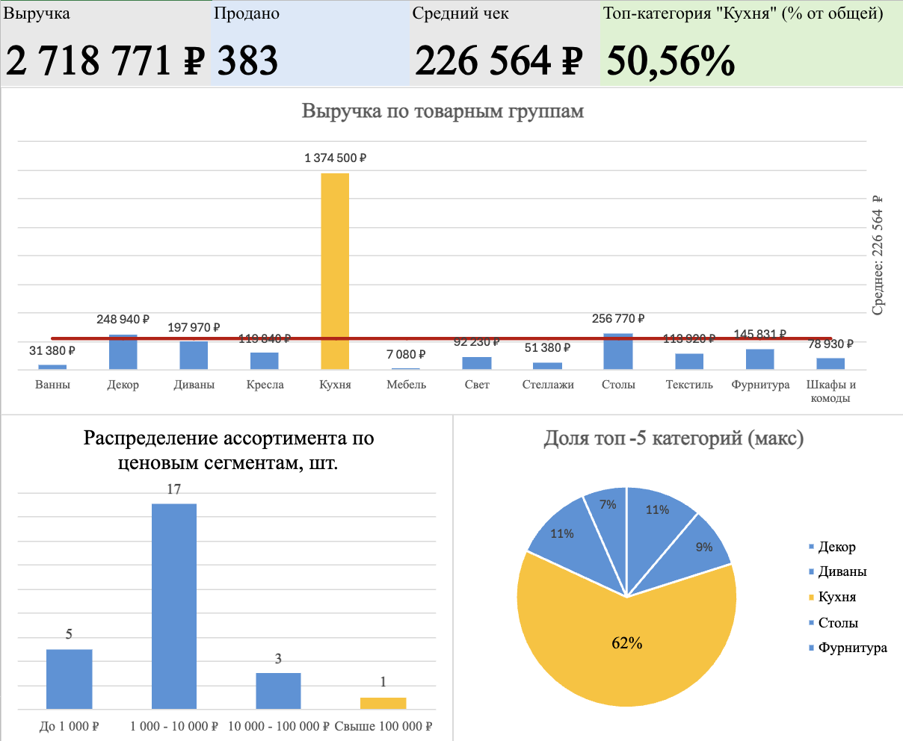
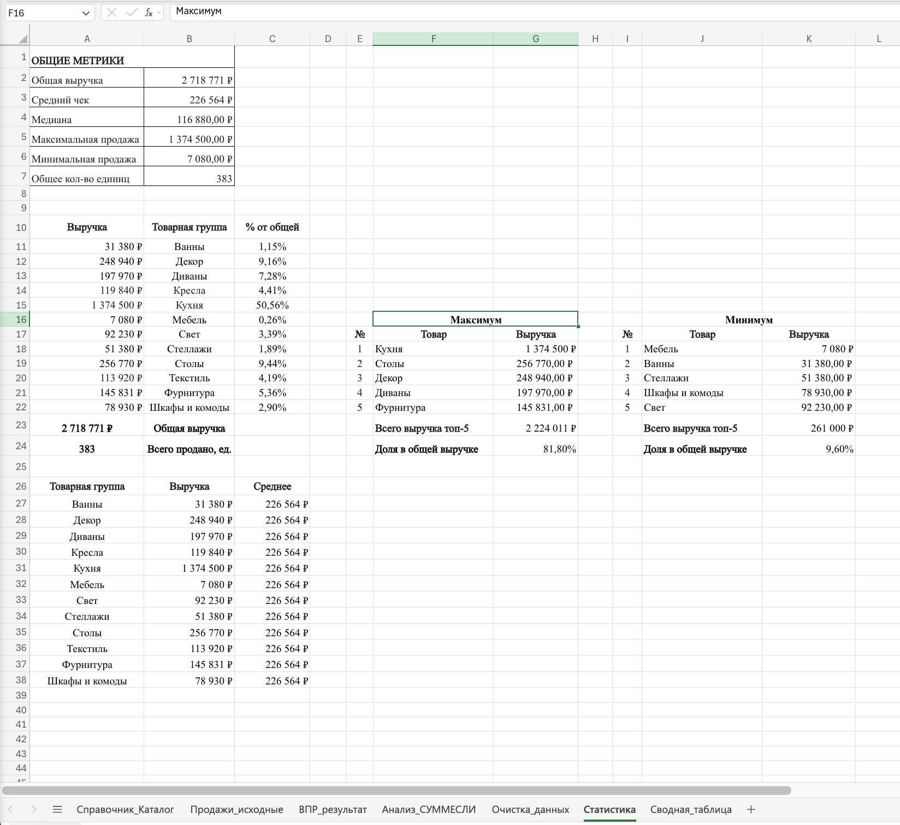
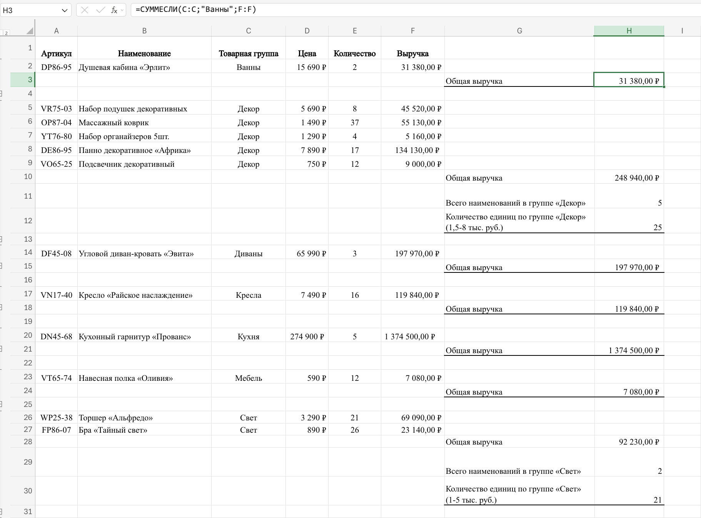
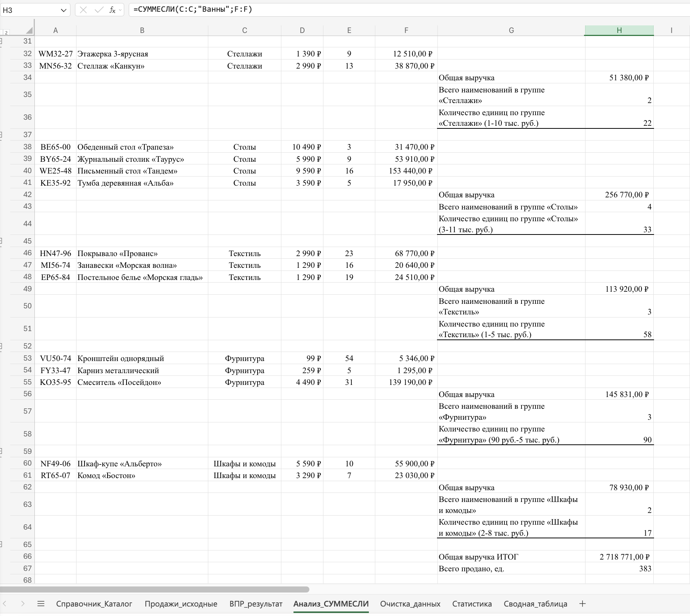

# Анализ продаж магазина товаров для дома

**Ссылка на Excel файл:** [Скачать Кейс1_Анализ_продаж.xlsx](Кейс1_Анализ_продаж.xlsx)

## Цель исследования
Проанализировать структуру продаж магазина товаров для дома, выявить драйверы выручки и оценить зависимость бизнеса от топ-категорий товаров.

## Задачи исследования
1. Обогатить данные о продажах: подтянуть артикулы и товарные группы из справочника (ВПР)
2. Рассчитать выручку по товарным группам (СУММЕСЛИ)
3. Провести статистический анализ: средний чек, максимум/минимум, топ-5 категорий
4. Создать интерактивный дашборд с визуализацией ключевых метрик

## Использованные инструменты и методы
- **Excel функции:** ВПР (VLOOKUP), СУММЕСЛИ (SUMIF), СЧЁТЕСЛИ (COUNTIF), СУММЕСЛИМН (SUMIFS)
- **Сводные таблицы** для агрегации данных
- **Визуализация:** гистограммы, круговые диаграммы, контрольные линии (линия среднего)
- **Интерактивность:** срезы (slicers) для фильтрации данных

## Ход исследования

### Этап 1: Обогащение данных (ВПР)
Подтянула артикулы и товарные группы из справочника в таблицу продаж. Получена полная таблица из 26 товаров с артикулами, группами, ценами и количеством.

### Этап 2: Расчет выручки по группам (СУММЕСЛИ)
Рассчитала общую выручку, количество наименований и единиц для каждой товарной группы. Выявлено 12 товарных категорий.

### Этап 3: Статистический анализ
- Общая выручка: **2 718 771 ₽**
- Средний чек: **226 564 ₽**
- Медиана: **116 880 ₽**
- Всего продано: **383 единицы**
- Разброс цен: от 750 ₽ до 274 900 ₽ (в 366 раз!)

### Этап 4: Визуализация (Дашборд)
Создала интерактивный дашборд с:
- KPI-карточками (выручка, средний чек, количество проданных единиц)
- Выручкой по товарным группам с контрольной линией среднего
- Распределением ассортимента по ценовым сегментам
- Долей топ-5 категорий

## Выводы по результатам исследования

1. **Высокая концентрация выручки:** Топ-5 товарных групп приносят 81,80% всей выручки.
2. **Критическая зависимость от одного товара:** Кухонный гарнитур «Прованс» (274 900 ₽) генерирует 50,56% выручки. Это аномалия: цена в 6 раз выше среднего чека.
3. **Структура ассортимента:** 65% товаров (17 из 26) в сегменте 1 000-10 000 ₽, но они приносят меньшую долю выручки.
4. **Аутсайдеры:** Группы Мебель (0,26%) и Ванны (1,15%) показывают минимальную выручку.

## Визуализация

### Дашборд

### Статистика

### Анализ выручки по группам
 

## 📄 Презентация

 [Скачать презентацию в PDF](Case1_Presentation.pdf)