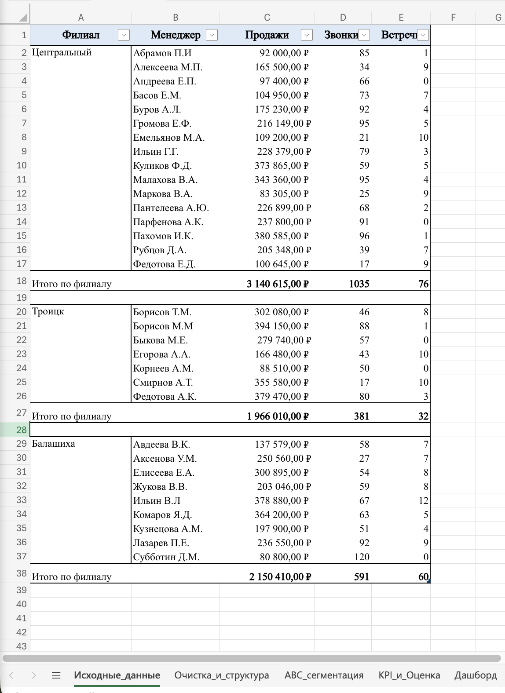
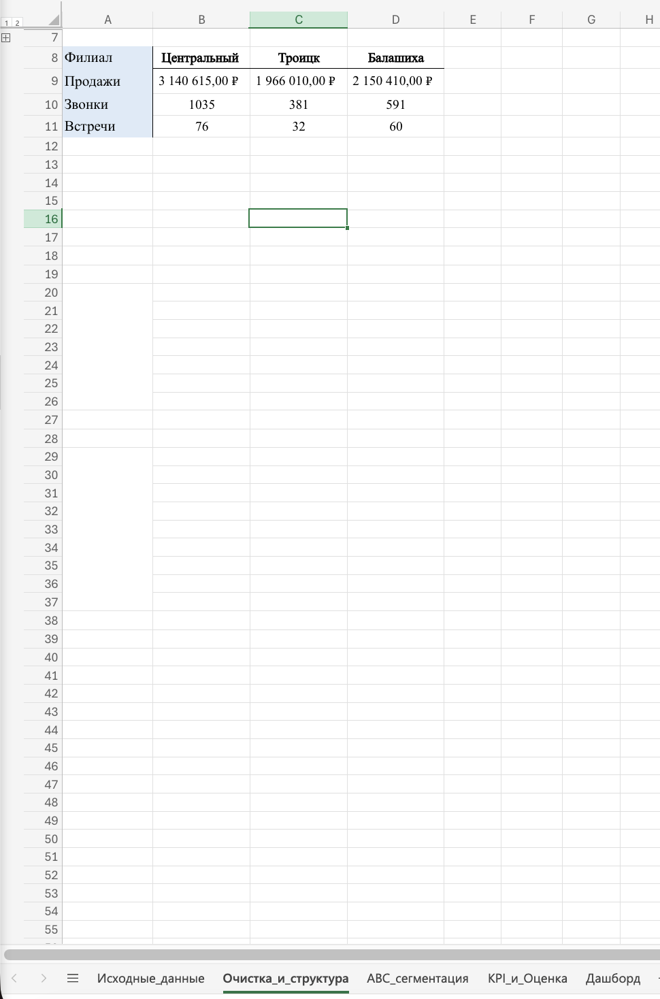
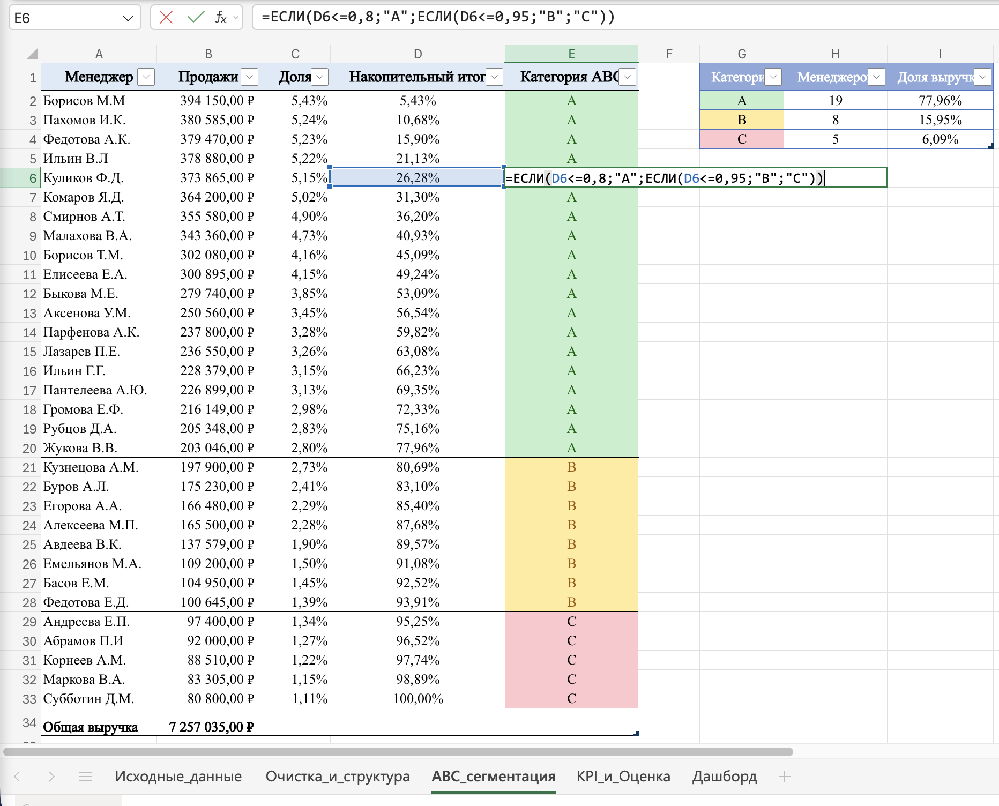
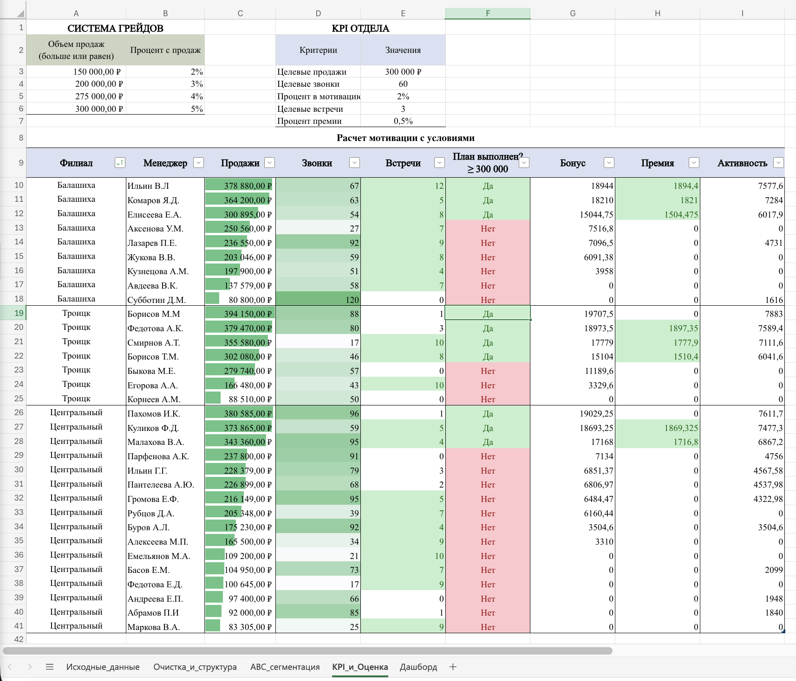
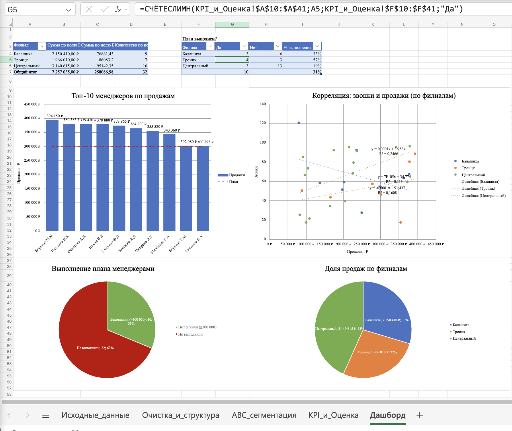

# Кейс 2: ABC-анализ отдела продаж

**Ссылка на Excel файл:** [Скачать Кейс2_ABC-анализ_отдела_продаж.xlsx](Кейс2_ABC-анализ_отдела_продаж.xlsx)

## Цель исследования
Комплексно оценить эффективность отдела продаж (32 менеджера, 
3 филиала): выявить ключевых сотрудников, приносящих основную 
выручку, оценить выполнение плана и систему мотивации, найти 
драйверы продаж и сформулировать рекомендации бизнесу.

## Задачи исследования
1. Подготовить данные: очистить и изменить структуру
2. Сегментировать менеджеров по вкладу в выручку (ABC-анализ)
3. Рассчитать систему мотивации (бонус, премия, активность) 
   с помощью логических функций
4. Оценить выполнение плана по менеджерам и филиалам
5. Проверить гипотезу о связи активности (звонки) и продаж
6. Визуализировать результаты и сформулировать рекомендации

## Использованные инструменты и методы
- **Excel** — все расчёты и визуализации
- **Логические функции** — ЕСЛИ, И, ИЛИ, НЕ, вложенные ЕСЛИ
- **ABC-анализ** — сегментация по принципу Парето (80/20)
- **Сводные таблицы и СЧЁТЕСЛИМН** — агрегация по филиалам 
  и выполнению плана
- **Условное форматирование** — гистограммы, цветовые шкалы, 
  выделение по условию
- **Диаграммы** — точечная (корреляция, тренды, R²), столбчатая 
  (топ-10), круговые (доли)
- **Очистка данных** — заполнение пустых значений, транспонирование

## Ход исследования

### Этап 1: Исходные данные (вкладка «Исходные_данные»)
Показатели работы отдела продаж: 32 менеджера, 3 филиала. 
Метрики: продажи, звонки, встречи, итоги по филиалам.
Проблема в данных: филиал указан только в первой строке 
группы, ниже — пустые ячейки.

### Этап 2: Изменение структуры — транспонирование 
(вкладка «Очистка_и_структура»)
Сохранена на вкладке в двух версиях: «до» (филиалы строками) 
и «после». Транспонировала итоги по филиалам: филиалы стали 
столбцами, показатели — строками. В таком виде филиалы удобно 
сравнивать между собой в одном взгляде.

### Этап 3: ABC-сегментация (вкладка «ABC_сегментация»)
Взяла из исходных данных менеджеров и продажи, отсортировала 
по продажам (убывание). Колонки «Доля», «Накопительный итог» 
и «Категория» добавила самостоятельно — применила методику 
ABC поверх учебного задания:

- **Доля:** `=B2/$B$34`
- **Накопительный итог:** `=C3+D2`
- **Категория:** `=ЕСЛИ(D2<=0,8;"A";ЕСЛИ(D2<=0,95;"B";"C"))`

Результат: A — 19 менеджеров (78% выручки), B — 8 (16%), 
C — 5 (6%).

### Этап 4: KPI и мотивация (вкладка «KPI_и_Оценка»)
Заполнила пустые значения «Филиал» (data cleaning) — иначе 
сводные таблицы собирали бы менеджеров в группу «(пусто)». 
Вынесла справочники «Система грейдов» и «KPI отдела» и 
рассчитала по каждому менеджеру:

- **План выполнен (≥ 300 000 ₽):** `=ЕСЛИ(C10>=$E$3;"Да";"Нет")`
- **Бонус по грейдам (вложенные ЕСЛИ, 2–5%):** 
  `=ЕСЛИ(C10>=$A$6;C10*$B$6;ЕСЛИ(C10>=$A$5;C10*$B$5;ЕСЛИ(C10>=$A$4;C10*$B$4;ЕСЛИ(C10>=$A$3;C10*$B$3;0))))`
- **Премия (И + НЕ):** `=ЕСЛИ(И(C10>$E$3;НЕ(E10<$E$6));C10*$E$7;0)`
- **Активность (ИЛИ):** `=ЕСЛИ(ИЛИ(C10>$E$3;D10>$E$4);C10*$E$5;0)`

Применила условное форматирование: гистограммы по продажам и 
звонкам, цветовые шкалы, выделение цветом плана и премий.

### Этап 5: Дашборд (вкладка «Дашборд»)
- **Сводная таблица** по филиалам: продажи, бонус, численность
- **Таблица «План выполнен?»** через СЧЁТЕСЛИМН: Да / Нет / 
  % выполнения по филиалам
- **Топ-10 менеджеров** по продажам с линией плана
- **Точечная диаграмма** «Корреляция: звонки и продажи» с 
  линиями тренда и R² по филиалам
- **Круговые диаграммы:** выполнение плана, доля продаж по 
  филиалам

## Выводы по результатам исследования
1. **Топ-10 менеджеров (31% штата) приносят 49% выручки** — 
   3 573 065 ₽ из 7 257 035 ₽
2. **Категория A — 19 из 32 менеджеров — даёт 78% выручки**, 
   категория C (5 человек) — лишь 6%
3. **Филиалы работают по-разному:** Центральный даёт 43% 
   выручки, но план выполнили лишь 19% менеджеров (тянут 
   лидеры); Троицк — самый стабильный (57% на плане)
4. **Корреляция звонков и продаж слабая (R² = 0,11–0,25)** — 
   решает качество сделок, а не количество касаний
5. **План выполнили ровно 10 менеджеров** — они же составляют 
   весь топ-10; остальным 22 нужна поддержка или пересмотр 
   норматива
6. **Бонусный фонд — 258 087 ₽ (3,6% от выручки)** — разумная 
   нагрузка на ФОТ

**Рекомендации бизнесу:**

- **Центральный филиал:** разобрать практики топ-менеджеров с 
  остальными (менторство)
- **Троицк:** масштабировать подход на другие филиалы
- **Все филиалы:** пересмотреть норматив звонков, сместить 
  фокус на встречи и качество сделок

## Визуализация

### Исходные данные и транспонирование
 

### ABC-сегментация и KPI-оценка
 

### Дашборд

## 📄 Презентация
[Скачать презентацию в PDF](Case2_Presentation.pdf)
